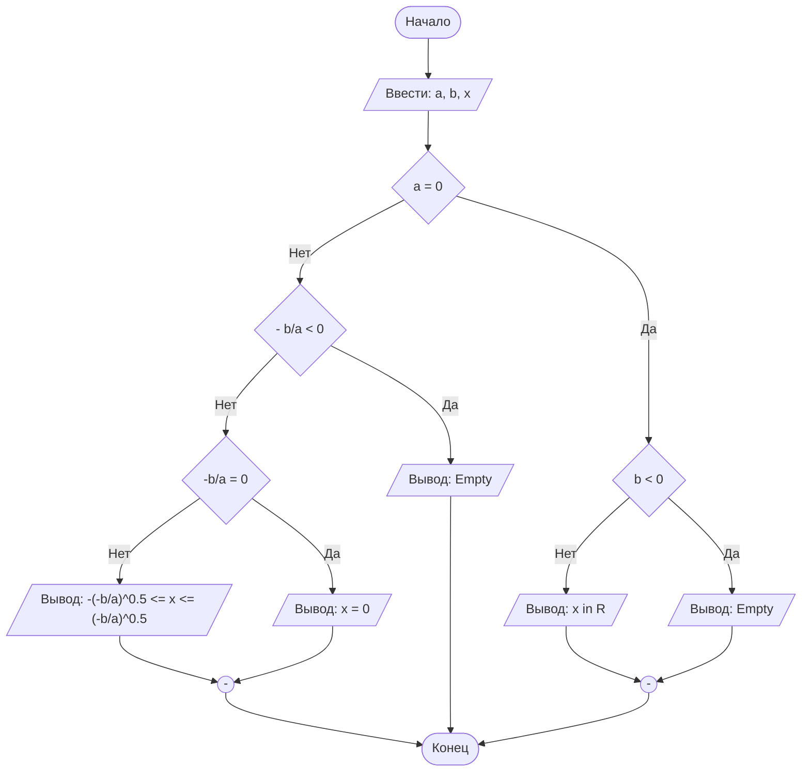

## Отчет по лабораторной работе № 1

#### № группы: `ПМ-2502`

#### Выполнил: `Пашенко Виталий Витальевич`

#### Вариант: `13`

### Cодержание:

- [Постановка задачи](#1-постановка-задачи)
- [Входные и выходные данные](#2-входные-и-выходные-данные)
- [Выбор структуры данных](#3-выбор-структуры-данных)
- [Алгоритм](#4-алгоритм)
- [Программа](#5-программа)
- [Анализ правильности решения](#6-анализ-правильности-решения)

### 1. Постановка задачи

> Набор бусинок диаметрами A, B, C, D, надетый на нить, пытаются протащить в указанном порядке через отверстие диаметром X. Какое количество
бусинок удастся протащить через отверстие? На вход программы подаются
натуральные числа X, A, B, C, D.

#### Для решения этой задачи необходимо сравнивать размер бусин с отверстием.
#### Для прохождения бусины через отверстие необходимо, чтобы диаметр отверстия `Х` был больше диаметра конкретно взятой бусины.
#### Чтобы определить количество бусин, которое удастся протащить через отверстие, необходимо поэтапно сравнить диаметр отдельной бусины `А, B, C, D` c диаметром отверстия `Х`.
#### Если бусина не прошла через отверстие, значит и последующие не смогут преодолеть его, так как им преградить путь бусина, которая оказалось слишком большой.

### 2. Входные и выходные данные

#### Данные на вход

На вход программа должна получать 5 чисел. Так как, по условию, это диаметры, то числа принадлежат множеству положительных вещественных чисел. 
|             | Тип                              | min значение    | max значение   |
|-------------|----------------------------------|-----------------|----------------|
| A (Число 1) | Вещественное положительное число | >0              | 10<sup>9</sup> |
| B (Число 2) | Вещественное положительное число | >0              | 10<sup>9</sup> |
| C (Число 3) | Вещественное положительное число | >0              | 10<sup>9</sup> |
| D (Число 4) | Вещественное положительное число | >0              | 10<sup>9</sup> |
| X (Число 5) | Вещественное положительное число | >0              | 10<sup>9</sup> |

#### Данные на выход

Так как программа должна вывести количество бусин, которым удастся протащить через отверстие, то на выход мы получим целое неотрицательное число, не превосходящее 4.

|         | Тип                                | min значение | max значение   |
|---------|------------------------------------|--------------|----------------|
| Число 1 | Целое неотрицательное число        | 0            | 4              |
### 2,5. Математическая модель

Если нужно.

### 3. Выбор структуры данных

Анализ (рассуждения) и обоснования того, где и как Вы собираетесь хранить всё то,
что нужно для работы программы.

### 4. Алгоритм

На русском языке подробно расписать, что и в каком порядке делает Ваша программа.

В 1 лабораторной работе блок-схем обязательна. Ниже представлен пример с лекции,
реализованный с помощью `mermaid` - инструментом для рисования диаграмм и блок-схем.

```markdown
    ```mermaid
        ([Начало]) --> B[/Ввести: a, b, x/]
        B --> C{a = 0}
        C -- Нет --> D{- b/a < 0}
        D -- Нет --> E{"-b/a = 0"}
        E -- Нет --> F[/"Вывод: -(-b/a)^0.5 <= x <= (-b/a)^0.5"/]
        E -- Да --> G[/Вывод: x = 0/]
        D -- Да --> H[/Вывод: Empty/]
        C -- Да --> I{b < 0}
        I -- Нет --> J[/Вывод: x in R/]
        I -- Да --> K[/Вывод: Empty/]
        J --> M(("-"))
        K --> M
        G --> L(("-"))
        H ----> Z
        F --> L
        M --> Z
        L --> Z([Конец])
    ``` 
```




`Mermaid` нативно интегрирован в `GitHub`, а для работы в Вашей среде разработке - нужно установить
плагин: `File` > `Settings` > `Plugins`.


### 5. Программа

Полный текст программы с комментариями на русском языке

Нужно вставить код прямо в отчет в блок:

```markdown
    ```java
        class Main{
            // Что-то далее
        }
    ``` 
```

Это будет выглядеть следующим образом:

```java
class Main{
    // Что-то далее
}
```

### 6. Анализ правильности решения

Привести тесты и анализ работы программы для этих тестов.
Очень неплохо было бы обосновать выбор тестов.

1. Тест на что-то

- Input:
    ```
    1
    1
    ```

- Output:
    ```
    2
    ```

2. Тест на что-то еще

- Input:
    ```
    1
    -1
    ```

- Output:
    ```
    0
    ```
