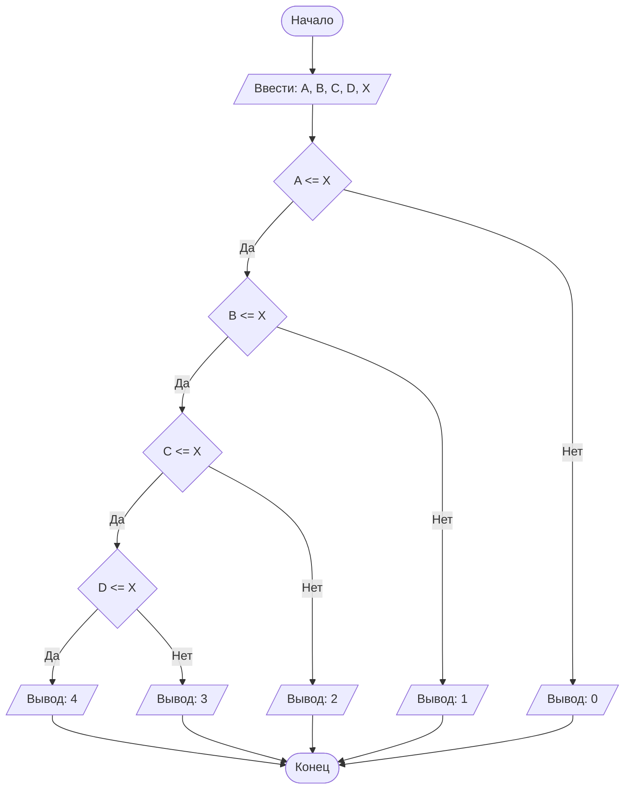

## Отчет по лабораторной работе № 1

#### № группы: `ПМ-2502`

#### Выполнил: `Пашенко Виталий Витальевич`

#### Вариант: `13`

### Cодержание:

- [Постановка задачи](#1-постановка-задачи)
- [Входные и выходные данные](#2-входные-и-выходные-данные)
- [Выбор структуры данных](#3-выбор-структуры-данных)
- [Алгоритм](#4-алгоритм)
- [Программа](#5-программа)
- [Анализ правильности решения](#6-анализ-правильности-решения)

### 1. Постановка задачи

> Набор бусинок диаметрами A, B, C, D, надетый на нить, пытаются протащить в указанном порядке через отверстие диаметром X. Какое количество
бусинок удастся протащить через отверстие? На вход программы подаются
натуральные числа X, A, B, C, D.

Для решения этой задачи необходимо сравнивать размер бусин с отверстием.

Для прохождения бусины через отверстие необходимо, чтобы диаметр отверстия `Х` был не меньше диаметра конкретно взятой бусины.

Чтобы определить количество бусин, которое удастся протащить через отверстие, необходимо поэтапно сравнить диаметр отдельной бусины `А, B, C, D` c диаметром отверстия `Х`.

Если бусина не прошла через отверстие, значит и последующие не смогут преодолеть его, так как им преградить путь бусина, которая оказалось слишком большой.

### 2. Входные и выходные данные

#### Данные на вход

На вход программа должна получать 5 чисел. Так как, по условию, это диаметры, то числа принадлежат множеству натуральных чисел. Верхнюю границу определим, как верхнюю границу типа данных `int`.
|             | Тип                              | min значение    | max значение     |
|-------------|----------------------------------|-----------------|------------------|
| A (Число 1) | Натуральное число                | 1               | 2<sup>31</sup>-1 |
| B (Число 2) | Натуральное число                | 1               | 2<sup>31</sup>-1 |
| C (Число 3) | Натуральное число                | 1               | 2<sup>31</sup>-1 |
| D (Число 4) | Натуральное число                | 1               | 2<sup>31</sup>-1 |
| X (Число 5) | Натуральное число                | 1               | 2<sup>31</sup>-1 |

#### Данные на выход

Так как программа должна вывести количество бусин, которым удастся протащить через отверстие, то на выход мы получим целое неотрицательное число, не превосходящее 4.

|         | Тип                                | min значение | max значение   |
|---------|------------------------------------|--------------|----------------|
| Число 1 | Целое неотрицательное число        | 0            | 4              |

### 3. Выбор структуры данных

Программа получает 5 натуральных чисел, не превышающих 2<sup>31</sup>-1. Для их хранения потребуется 5 переменных (`A`, `B`, `C`, `D`, `X`) типа `int`.

Вывод необязательно хранить в отдельной переменной.

### 4. Алгоритм

1. **Ввод данных:**  
   Программа считывает 5 натуральных чисел, обозначенные как `A`, `B`, `C`, `D` и `X`.

2. **Сравнение чисел:**  
   Программа поочередно сравнивает значения от `A` до `D` с `X`. Если какой-то из элементов больше чем `X`, то на экран выводится результат.
   
3. **Вывод результата:**  
   На экран выводится либо максимальный результат, если все диаметры бусин меньше диаметра отверстия, либо одно из чисел, которое программа выводит в пункте два.

#### Блок-схема



### 5. Программа

Полный текст программы с комментариями на русском языке

```java
import java.io.PrintStream;
import java.util.Scanner;

public class Main {
    // Объявляем объект класса Scanner для ввода данных
    public static Scanner in = new Scanner(System.in);
    // Объявляем объект класса PrintStream для вывода данных
    public static PrintStream out = System.out;

    public static void main(String[] args) {
        // Считывание пяти натуральных чисел A, B, C, D и X из консоли
        int A = in.nextInt();
        int B = in.nextInt();
        int C = in.nextInt();
        int D = in.nextInt();
        int X = in.nextInt();

        // Сравнение диаметра первого шарика с диаметром отверстия.
        // Если первый шарик меньше, то можем сравнивать диаметр следующего шарика.
        // Иначе выводим кол-во протащенных шариком, то есть 0.
        if (A <= X)
            // Сравнение диаметра второго шарика с диаметром отверстия.
            // Если второй шарик меньше, то можем сравнивать диаметр следующего шарика.
            // Иначе выводим кол-во протащенных шариком, то есть 1.
            if (B <= X)
                // Сравнение диаметра третьего шарика с диаметром отверстия.
                // Если третий шарик меньше, то можем сравнивать диаметр следующего шарика.
                // Иначе выводим кол-во протащенных шариком, то есть 2.
                if (C <= X)
                    // Сравнение диаметра четвертого шарика с диаметром отверстия.
                    // Если четвертый шарик меньше, то выводим кол-во протащенных шариком, то есть 4.
                    // Иначе выводим кол-во протащенных шариком, то есть 3.
                    if (D <= X)
                        out.print(4);
                    else
                        out.print(3);
                else
                    out.print(2);
            else
                out.print(1);
        else
            out.print(0);
    }
}
```

### 6. Анализ правильности решения
Программа работает корректно на всем множестве решений с учетом ограничений.

1. Тест на `X >= A >= B >= C >= D`:
   
   - **Input**:
        ```
        1 2 3 4 5
        ```

   - **Output**:
        ```
        4
        ```
Вывод равен 4, так как все элементы меньше X.

2. Тест на `X < A`:
   
   - **Input**:
        ```
        6 2 3 4 5
        ```

   - **Output**:
        ```
        0
        ```
        
Вывод равен 0, так как первый элемент больше X (Он преградит остальным путь).

3. Тест на `B > X > A`:
   
   - **Input**:
        ```
        1 6 3 4 5
        ```

   - **Output**:
        ```
        1
        ```
   Вывод равен 1, так как второй элемент больше X, но предыдущий меньше X.
   
5. Тест на `C > X > A >= B`:
   
   - **Input**:
        ```
        1 2 6 4 5
        ```

   - **Output**:
        ```
        2
        ```
   Вывод равен 2, так как третий элемент больше X, но предыдущие меньше X.

6. Тест на `D > X > A >= B >= C`:
   
   - **Input**:
        ```
        1 2 2 6 5
        ```

   - **Output**:
        ```
        3
        ```
   Вывод равен 3, так как четвертый элемент больше X, но предыдущие меньше X.

7. Тест на ограничения задачи (2147483647 = 2<sup>31</sup>-1):
   
   - **Input**:
        ```
        2147483643 2147483646 2147483645 2147483647 2147483646
        ```

   - **Output**:
        ```
        3
        ```
   Вывод равен 3, так как четвертый элемент больше X, но предыдущие меньше X.
